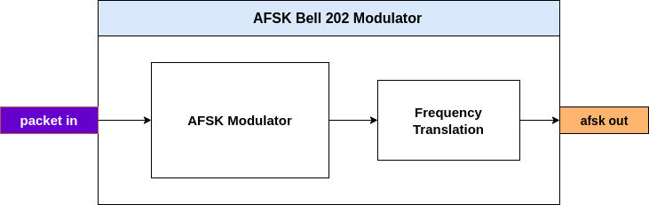
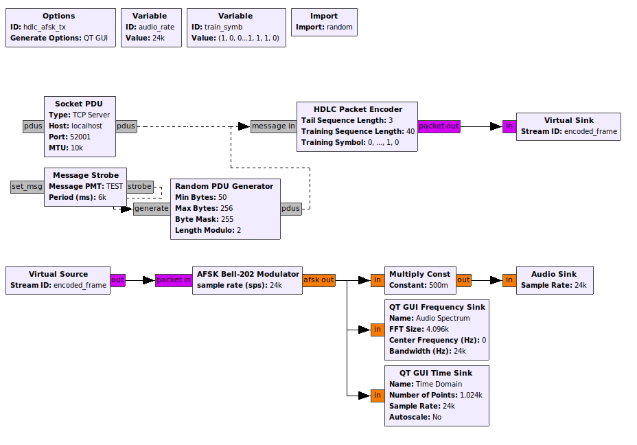
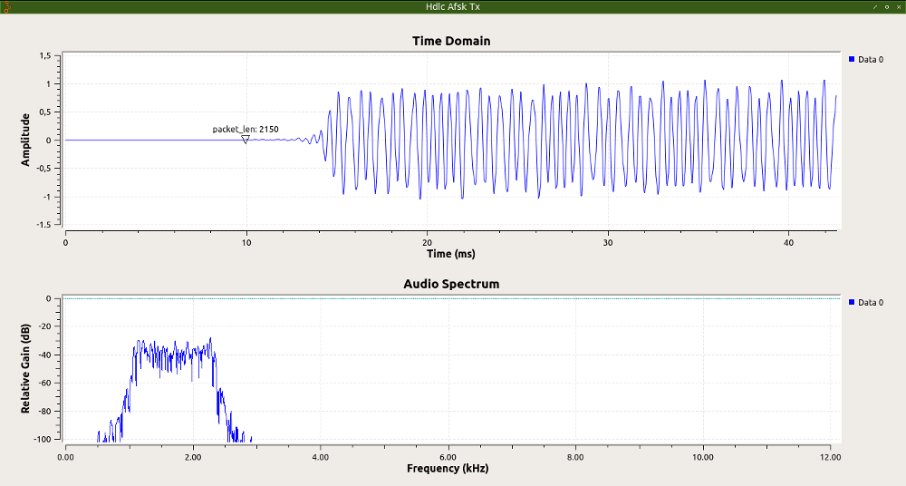

# AFSK BELL 202 Modulator

This is a GNU Radio hierblock to create Bell 202 standard AFSK modulation. This block expecting input as a bitstream and outputs AFSK modulated real signal stream. 

Tested on **GNU Radio v3.7.11** - Ubuntu.


## Index
1. [Installation](#Installation)
2. [AFSK Bell 202 Modulator in More Detail](#Detail)
3. [Example](#Example)
4. [TODO](#TODO)

## Installation
You have to have **GNU Radio v3.7.10** (or newer) in your computer first.
```
$ cd
$ cd gr-HDLC-AFSK/hierblocks/afsk-bell202-modulator/
$ gnuradio-companion afsk_bell202_mod.grc
```
* Run the flowgraph (F6).
* Reload Blocks
* Finish. Now this hierblock will appear under **HDLC AFSK** category as **AFSK Bell-202 Modulator** block.


## Detail

* This AFSK Modulator outputs 1700 Hz-centered AFSK signal with *__mark__* frequency is 1200 Hz and *__space__* frequency is 2200 Hz.

* Baudrate is fixed at 1200. Real baudrate implementation is through symbol repetition.

* The output of the modulator is pulse shaped using a root raised cosine filter. This filter ensures only bandwidth-limited modulation signal is produced.

The following is the AFSK Bell 202 Modulator's bigger picture:



## Example




**File:** 
```
gr-HDLC-AFSK/hierblocks/afsk-bell202-modulator/afsk_bell202_mod-example.grc
```

## TODO

// *TODO*