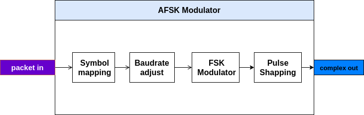
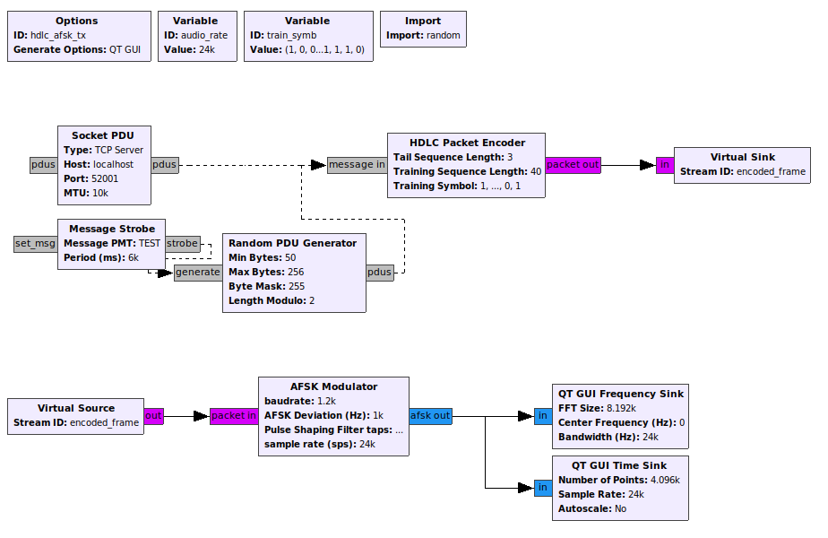
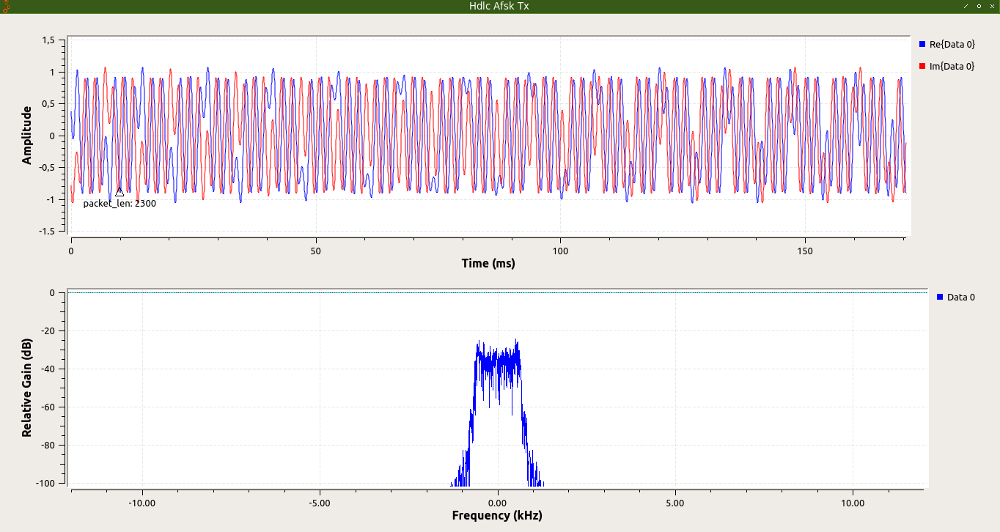

# AFSK Modulator

This is a GNU Radio hierblock to create (A)FSK based modulation. This block expecting input as a bitstream and outputs FSK modulated complex signal stream. 

Tested on **GNU Radio v3.7.11** - Ubuntu.


## Index
1. [Installation](#Installation)
2. [AFSK Modulator in More Detail](#Detail)
3. [Example](#Example)
4. [TODO](#TODO)

## Installation
You have to have **GNU Radio v3.7.10** (or newer) in your computer first.
```
$ cd
$ cd gr-HDLC-AFSK/hierblocks/afsk-modulator/
$ gnuradio-companion afsk_mod.grc
```
* Run the flowgraph (F6).
* Reload Blocks
* Finish. Now this hierblock will appear under **HDLC AFSK** category as **AFSK Modulator** block.


## Detail

* This AFSK Modulator outputs zero-centered AFSK signal with *__mark__* frequency is -0.5 * *fsk_dev* and *__space__* frequency is +0.5 * *fsk_dev*.

* Baudrate is adjustable (default: 1200 baud). Real baudrate implementation is through symbol repetition.

* Symbols are **1** for bit 0 or *space* and **0** for bit 1 or *mark*.

* The output of the modulator is pulse shaped using a root raised cosine filter. This filter ensures only bandwidth-limited modulation signal is produced.

The following is the AFSK Modulator's bigger picture:



## Example




**Files:** 
```
gr-HDLC-AFSK/hierblocks/afsk-modulator/afsk_mod-example.grc
gr-HDLC-AFSK/hierblocks/afsk-modulator/afsk_mod-example-minimum-shift-keying.grc
```

## TODO

// *TODO*