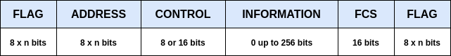
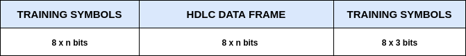
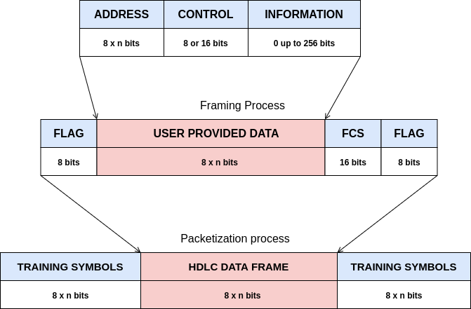
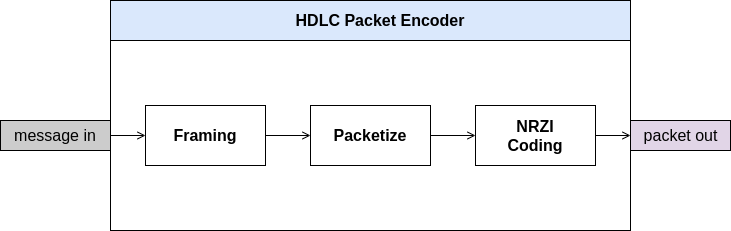
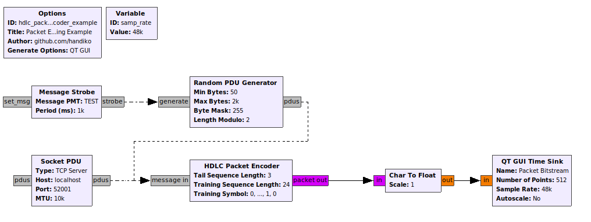

# HDLC Packet Encoder

This is a GNU Radio hierblock to construct **HDLC** packet. The input is raw data field message (**ADDRESS** field(s), **CONTROL** field, **INFORMATION** field, etc), without the FLAG(s) and FCS. 
The output is bitstream which already contain complete HDLC packet format (including **PREAMBLE** or TRAINING_SEQUENCE, **HEADER_FLAG**, **FCS**, **POSTAMBLE_FLAG**, and **TRAILING_SEQUENCE**).

Tested on **GNU Radio v3.7.11** - Ubuntu.


## Index
1. [Installation](#Installation)
2. [HDCL Packet Encoder in More Detail](#Detail)
3. [Example](#Example)
4. [TODO](#TODO)

## Installation
You have to have **GNU Radio v3.7.10** (or newer) in your computer first.
```
$ cd
$ cd gr-HDLC-AFSK/hierblocks/hdlc-packet-encoder/
$ gnuradio-companion hdlc-packet-encoder.grc
```
* Run the flowgraph (F6).
* Reload Blocks
* Finish. Now this hierblock will appear under **HDLC AFSK** category as **HDLC Packet Encoder** block.


## Detail

* Consider the following **HDLC data frame**,

with the FLAG(s) are 0x7E character at least one byte and the FCS are CRC-16-CCITT.


* In order to be transmitted over the medium, for example using AFSK modulation, the data frame above needs to be added with training symbols or *PREAMBLE*. This training symbols are used as clock synchronization symbols by the receiver. Therefore, the data frame above should be packetized as the following:

We can use (1,0,1,0,1,0,1,0,...) as training symbols for receiver synchonization.


* This **HDLC Packet Encoder** block will handle the HDLC frame construction as well as the complete packet from user-provided message input which are **ADDRESS**, **CONTROL**, and **INFORMATION**(optional) field.



* Moreover, the bigger picture of which happen inside this **HDLC Packet Encoder** blocks is the following:


NRZI coding (differential encoder) is added to make the packet compatible with the most standard. This differential coding also makes the packet practically immune to the bit polarization reversal.

## Example



**File:** 
```
gr-HDLC-AFSK/hierblocks/hdlc-packet-encoder/hdlc_packet_encoder-example.grc
```

## TODO

// *TODO*